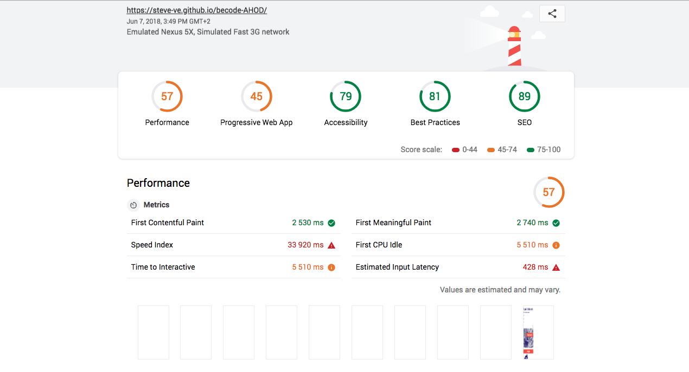

# One-Pager Website

- **Client** : Repair Café Scharbeek 
- **Where ?** : At [Becode](https://github.com/becodeorg/)
- **When ?** :  07/06/2018
- **By who ?** : [Steve Van Esseche](https://github.com/Steve-VE), [Marie Cambie](https://github.com/mcambie) & [Pedro Seromenho](https://github.com/pedroseromenho/)
- **The Website** : [HERE](https://steve-ve.github.io/becode-AHOD/) - *v1*.

## About

Nous avons reçu un projet (un site inexistant ou existant mais pas terrible terrible), et nous avons dû réaliser et déployer en quelques heures un *one-pager* qui propose une meilleure version de ce projet, attractif, allant à l'essentiel, en utilisant un framework CSS, avec au moins une animation CSS.

- repository : `becode-AHOD`
- team : `true`
- Durée : `6h`

## Objectifs

- Déploier via une GitHub Pages
- Analyser le client et identifier un CTA qui ait du sens, ainsi que les arguments à avancer pour convaincre l'utilisateur de cliquer.
- Concevoir et réaliser **au moins une animation CSS** pour guider son regard, ou faciliter sa compréhension de l'objet du site
- Vérifier la sémantique html grâce au [W3C Validator](https://validator.w3.org/)
- Une fois la page réalisée et en ligne, utiliser le [Lighthouse Test](https://developers.google.com/web/tools/lighthouse/) et améliorer le code pour améliorer ses scores dans tous les domaines.
- Essayer d'en faire une Progressive Web App ([guide](https://dev.to/pixeline/the-easy-way-to-turn-a-website-into-a-progressive-web-app-77g))
- Si possible, trouver un nom de domaine gratuit
- Publier le résultat sur ce [formulaire](https://goo.gl/forms/Z544Q93eqeNdfZHI3) avant la fin de la deadline.

## Méthodes de travail

1. Faire connaissance;
2. Créer un répo, et des branches pour chacun;
3. Décortiquer la demande, en ciblant les mots clés;
4. Réaliser une maquette de structure, ensemble;
5. Repartition des taches:
    - Steve construit l'archictecture `html`;
    - Marie et Pedro ameillorent la maquette, en travaillant le layout, les couleurs et la typo.
6. Repartion des differentes sections `html`, pour réaliser le `css`;
7. Merger les branches et résoudre les conflits.
8. Repartition des taches:
    - Steve corrige les problèmes css;
    - Marie s'occupe de PWA;
    - Pedro test le site sur lighthouse, et rédige la première version du `README.md`
9. Envoi du résultat au jury.    

1. Faire connaissance;
2. Créer un répo, et des branches pour chacun;
3. Décortiquer la demande, en ciblant les mots clés;
4. Réaliser une maquette de structure, ensemble;
5. Repartition des taches:
    - Steve construit l'archictecture `html`;
    - Marie et Pedro ameillorent la maquette, en travaillant le layout, les couleurs et la typo.
6. Repartion des differentes sections `html`, pour réaliser le `css`;
7. Merger les branches et résoudre les conflits.
8. Repartition des taches:
    - Steve corrige les problèmes css;
    - Marie s'occupe de PWA;
    - Pedro test le site sur lighthouse, et rédige la première version du `README.md`
9. Envoi du résultat au jury.    

#### Test lighthouse

À cet stade (h-1), le résultat n'est pas assez convancaint, notament dans la performance. Nous avons donc, suite à ce test, corrigé au mieux le site.

#### Test W3

#### Le Mockup

[HERE PDF](mockup.pdf)

#### Difficultés rencontrées

L'utilisation obligatoire d'un framework css était sensé nous faciliter la vie, nous avons opté par l'utilisation de bootstrap. Cependant, ça nous a pas forcement aidé, car beaucoup nous avons passé beaucoup de temps à craquer le pluggin pour obtenir un résultat conforme avec la maquette.

