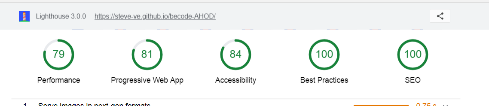

# One-Pager Website

- **Client** : Repair Café Scharbeek 
- **Where ?** : At [Becode](https://github.com/becodeorg/)
- **When ?** :  June 2018
- **By who ?** : [Steve Van Esseche](https://github.com/Steve-VE), [Marie Cambie](https://github.com/mcambie) & [Pedro Seromenho](https://github.com/pedroseromenho/)
- **The Website** : [HERE](https://steve-ve.github.io/becode-AHOD/) - *v2*.

## À Propos

Dans un premier temps, nous avons reçu un projet (un site inexistant ou existant mais pas terrible terrible), et nous avons dû réaliser et déployer en quelques heures un *one-pager* qui propose une meilleure version de ce projet, attractif, allant à l'essentiel, en utilisant un framework CSS. 
Suite à ce premier rendu, nous avons eu trois semaines pour l'améliorer.

## Objectifs

- Déploier via une GitHub Pages
- Analyser le client et identifier un CTA qui ait du sens, ainsi que les arguments à avancer pour convaincre l'utilisateur de cliquer.
- Concevoir et réaliser **au moins une animation CSS** pour guider son regard, ou faciliter sa compréhension de l'objet du site
- Vérifier la sémantique html grâce au [W3C Validator](https://validator.w3.org/)
- Une fois la page réalisée et en ligne, utiliser le [Lighthouse Test](https://developers.google.com/web/tools/lighthouse/) et améliorer le code pour améliorer ses scores dans tous les domaines.
- Essayer d'en faire une Progressive Web App ([guide](https://dev.to/pixeline/the-easy-way-to-turn-a-website-into-a-progressive-web-app-77g))

## Méthodes de travail
### Phases:
1. **Conception**: Création d'une maquette graphique, afin de séparer, organiser et structurer les contenu du site.
2. **Production**: Séparation des tâches en fonction des sections du site, grâce au kaban github.
3. **Corrections**: Corrections sémantiques et de performance.
4. **Rendu**: Création d'une Progressive Web App, et mise en ligne via github pages.

## Outils

#### Test lighthouse

#### Test W3C

#### Le Mockup

[HERE DESKTOP](mk-rc-desktop-c.pdf)
[HERE MOBILE](mk-rc-mobile-c.pdf)

